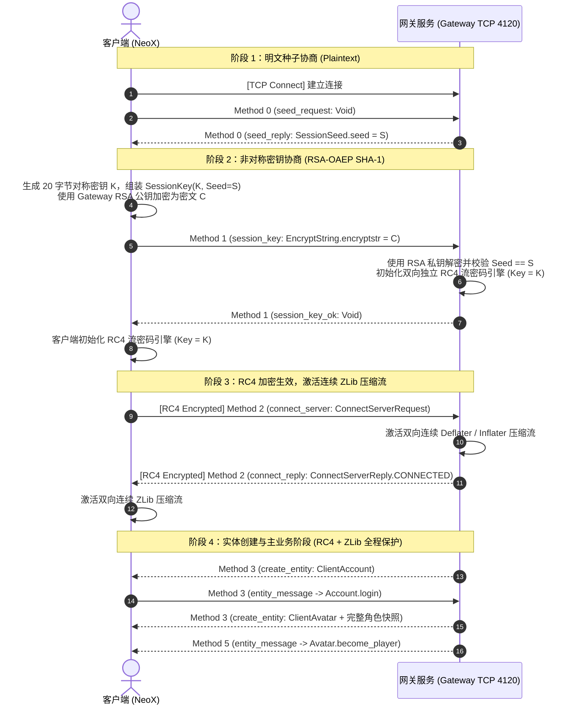
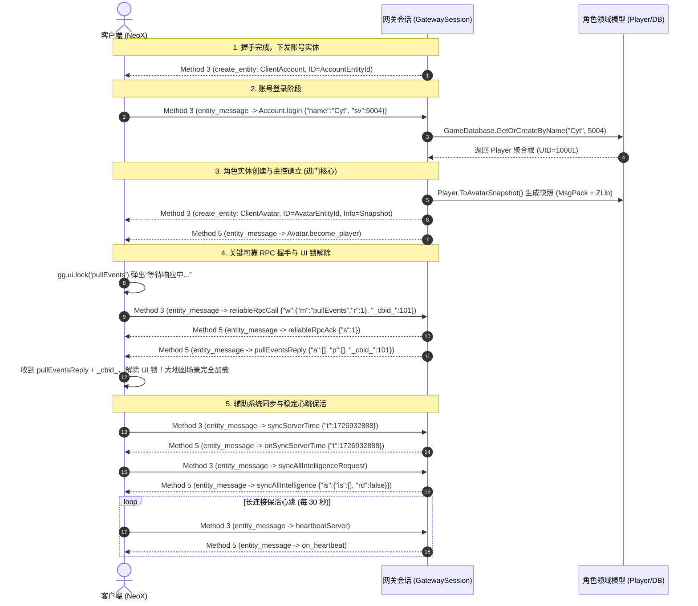

# QRZD Network Wire Protocol Analysis

本文档描述手游《永远的 7 日之都》的底层网络通信拓扑、TCP 线缆二进制分帧机制、递进式传输安全握手体系、Protobuf 底层载荷规范、分布式实体 RPC 与 MD5 方法哈希映射，以及角色创建与进门生命周期。

---

## 1. 网络传输拓扑与通道划分

qrzd 网络架构采用“**无状态 HTTP 调度/认证 + 有状态 TCP 分布式实体网关**”的双层通信拓扑：

```
┌────────────────────────────────────────────────────────────────────────┐
│                       Client Application (NeoX)                        │
└───────────────────┬────────────────────────────────┬───────────────────┘
                    │                                │
          HTTP/HTTPS (端口 443)               TCP (端口 4120)
                    │                                │
┌───────────────────▼───────────┐    ┌───────────────▼───────────────────┐
│     HTTP Dispatch & SDK       │    │         Game TCP Gateway          │
│  - /server_list_android.txt   │    │  - 动态会话协商与密钥交换         │
│    (区服列表、状态与网关导流) │    │  - RC4 全双工对称流加密           │
│  - /announcement_android      │    │  - RFC 1950 连续 ZLib 压缩流      │
│    (运营活动与停服公告)       │    │  - Protobuf 网关控制与分发        │
│                               │    │  - NeoX 分布式实体 RPC (MD5 散列) │
│                               │    │  - 角色状态同步、心跳与可靠 RPC   │
└───────────────────────────────┘    └───────────────────────────────────┘
```

### 通道职责矩阵

| 通道名称 | 传输层协议 | 默认端口 | 编解码与安全机制 | 业务职责说明 |
| :--- | :---: | :---: | :--- | :--- |
| **HTTP Dispatch** | HTTP/1.1 | 443 | 明文 CSV / JSON，部分接口带 HMAC-SHA256 签名 | 下发区服列表、发布地址分配、公告查询、免 SDK 账号角色映射 |
| **TCP Gateway** | TCP | 4120 | RSA-OAEP + RC4 + ZLib + Protobuf + BSON | 核心游戏长连接，承载账号握手、实体生命周期、角色快照与游戏主业务 |
| **UniSDK / URS** | HTTPS | 443 | TLS 1.2/1.3  | 官方渠道通行证登录、实名认证、防沉迷上报（本地调试模式已 Bypass） |

---

## 2. 主业务线缆帧格式 (Wire Framing)

游戏长连接运行在 TCP 字节流之上，网关在传输层使用经典的 **小端长度前缀帧（Length-Prefixed Framing）** 进行分包边界界定。

### 2.1 帧布局

```
┌──────────────────────────────────────────────────────────────────────────┐
│                   TCP RPC Frame (6-Byte Header + Body)                   │
├──────────────────────────────┬─────────────────────────────┬─────────────┤
│ Length (Payload 长度 + 2)    │ Method (RPC 内部方法号)     │ Payload     │
│ 4 bytes, Little-Endian       │ 2 bytes, Little-Endian      │ 变长二进制  │
└──────────────────────────────┴─────────────────────────────┴─────────────┘
```

### 2.2 包头字段定义

| 字节偏移 | 长度 (Bytes) | 字段名称 | 字节序 | 语义定义 |
| :---: | :---: | :--- | :---: | :--- |
| `0x00` | 4 | `Length` | **Little-Endian** | 紧随其后的有效载荷长度。计算公式为：`Payload.Length + 2` 字节（即包含 `Method` 本身的 2 字节） |
| `0x04` | 2 | `Method` | **Little-Endian** | 网关传输层方法标识（网关服务 RPC 编号，非游戏内业务方法） |
| `0x06` | 可变 | `Payload` | — | 实际数据载荷，自偏移 6 字节起，格式由具体的 `Method` 决定（Protobuf 结构体） |

### 2.3 传输层 Method 映射表

网关与客户端之间预定义的顶层传输层 Method ID：

| Method ID | 方向 | 对应 Proto 接口 | 载荷消息类型 | 语义说明 |
| :---: | :---: | :--- | :--- | :--- |
| `0` | C -> S | `seed_request` | `mobile.server.Void` | 客户端发起握手，请求服务端会话 Seed |
| `0` | S -> C | `seed_reply` | `mobile.server.SessionSeed` | 服务端回发 64 位随机会话 Seed |
| `1` | C -> S | `session_key` | `mobile.server.EncryptString` | 客户端上报经 RSA-OAEP 加密的对称密钥结构体 |
| `1` | S -> C | `session_key_ok`| `mobile.server.Void` | 服务端确认密钥解密成功，双方开启 RC4 加密 |
| `2` | C -> S | `connect_server`| `mobile.server.ConnectServerRequest` | 客户端发起业务连接确认（携带设备 ID） |
| `2` | S -> C | `connect_reply` | `mobile.server.ConnectServerReply` | 服务端下发连接确认，双方开启连续 ZLib 压缩流 |
| `3` | S -> C | `create_entity` | `mobile.server.EntityInfo` | 网关在客户端动态实例化分布式实体（Account/Avatar） |
| `3` | C -> S | `entity_message`| `mobile.server.EntityMessage` | 客户端向服务端特定实体发起 RPC 业务调用 |
| `4` | C -> S | `reg_md5_index` | `mobile.server.Md5OrIndex` | 客户端注册 MD5 与整数索引的映射，优化传输带宽 |
| `5` | S -> C | `entity_message`| `mobile.server.EntityMessage` | 服务端向客户端特定实体下发 RPC 回调或推送数据 |

---

## 3. 递进式传输安全握手体系 (Handshake & Security Pipeline)

qrzd设计了一套由浅入深、分阶段逐步激活加密与压缩的递进式握手协议：



### 3.1 阶段一：会话种子协商 (Session Seed)
- 客户端发起首包：Method `0`，载荷为标准空包 `Void`。
- 服务端生成强随机 64 位整型（`Int64`）并截断符号位：
  ```csharp
  long seed = BinaryPrimitives.ReadInt64LittleEndian(RandomNumberGenerator.GetBytes(8)) & long.MaxValue;
  ```
- 服务端响应 `SessionSeed { seed = seed }`，该 Seed 将在下一步参与客户端上报的有效性校验，有效抵御重放攻击。

### 3.2 阶段二：RSA-OAEP 密钥交换 (Session Key Exchange)
客户端生成会话对称密钥并加密上传：
1. **载荷组装**：客户端组装 Protobuf `SessionKey` 结构体：
   ```protobuf
   message SessionKey {
       required bytes random_padding_header = 1; // 2 ~ 9 字节随机填充
       required bytes session_key = 2;          // 20 字节对称会话密钥 K
       required int64 seed = 3;                 // 第一阶段下发的服务随机 Seed
       required bytes random_padding_tail = 4;   // 2 ~ 9 字节随机填充
   }
   ```
2. **算法标准**：
   - **填充方案**：**PKCS#1 RSA-OAEP (Optimal Asymmetric Encryption Padding)**
   - **散列函数**：**SHA-1**（摘要大小 160 位）
   - **掩码生成函数 (MGF)**：MGF1 (SHA-1)
   - **编码参数 (Label)**：空（Empty）
3. **服务端解密与状态机激活**：
   - 服务端使用 BouncyCastle 的 `OaepEncoding(new RsaEngine(), new Sha1Digest())` 解密密文；
   - 严格校验 `seed` 与 `session_key` 长度（必须为 20 字节）；
   - 从 `session_key` 提取 20 字节作为密钥，分别实例化客户端方向的 `_encryptor` 与服务端方向的 `_decryptor` 两个独立的 **RC4 (ARC4)** 流密码状态机；
   - 服务端下发 `session_key_ok`。**自此包下发之后，双向 TCP 链路的所有字节全部经过 RC4 XOR 混淆**。

### 3.3 阶段三：连接确认与 ZLib 压缩流激活 (ZLib Pipeline)
1. 客户端发送 RC4 加密的 Method `2`（`connect_server`），携带客户端版本、设备 ID 等信息。
2. 服务端回复 Method `2`（`connect_reply`，状态为 `CONNECTED`）。
3. **ZLib 连续流模型规范**：
   - 双方在此刻初始化连续的 `Deflater`（压缩）与 `Inflater`（解压）；
   - **压缩协议**：标准 RFC 1950 ZLIB 格式（带 `0x78 0x9C` 包头，非无头 Raw Deflate）；
   - **流式连续性**：压缩流状态机在整个 TCP 会话生命周期内是**连续累积**的（不跨包重置字典），服务端发送时 `SetInput(frame)` 并 `Flush()`，客户端按流持续 `Inflate()`。
4. **全阶段流水线架构**：
   - **下行发包流水线 (Server -> Client)**：
     `BasePacket` -> Protobuf 序列化 -> 写入 4 字节 Len + 2 字节 Method -> `Deflater.Deflate()` -> `RC4Engine.ProcessBytes()` -> TCP Socket 发送。
   - **上行收包流水线 (Client -> Server)**：
     TCP Socket 接收 -> `RC4Engine.ProcessBytes()` -> `Inflater.Inflate()` -> 流式组装 4 字节 Len + 2 字节 Method -> Protobuf 反序列化 -> 路由层。

---

## 4. Protobuf 网关控制层定义 (`gateway.proto`)

网关底层通信核心控制报文均通过标准 Protocol Buffers (proto2) 定义，定义了分布式实体的序列化描述：

```protobuf
syntax = "proto2";
package mobile.server;

message Void {}

message EncryptString {
    required bytes encryptstr = 1;      // RSA 密文（长度为公钥模数，如 128 或 256 字节）
}

message SessionSeed {
    required int64 seed = 1;            // 64 位随机防重放种子
}

message SessionKey {
    required bytes random_padding_header = 1;
    required bytes session_key = 2;     // 20 字节 RC4 对称密钥
    required int64 seed = 3;
    required bytes random_padding_tail = 4;
}

message ConnectServerRequest {
    enum RequestType { NEW_CONNECTION = 0; RE_CONNECTION = 1; BIND_AVATAR = 2; }
    optional bytes routes = 1;
    required RequestType type = 2;
    optional bytes deviceid = 3;
    optional bytes entityid = 4;
    optional bytes authmsg = 5;
    optional uint32 received_seq = 6;
}

message ConnectServerReply {
    enum ReplyType { BUSY = 0; CONNECTED = 1; RECONNECT_SUCCEEDED = 2; RECONNECT_FAILED = 3; FORBIDDEN = 4; MAX_CONNECTION = 5; }
    optional bytes routes = 1;
    required ReplyType type = 2 [default = BUSY];
    optional bytes entityid = 3;
    optional uint32 received_seq = 4;
}

message Md5OrIndex {
    optional bytes md5 = 1;             // 16 字节标准 MD5 散列
    optional sint32 index = 2 [default = -1]; // 动态注册的紧凑整数索引
    optional uint32 seq = 3;
}

message EntityMessage {
    optional bytes routes = 1;
    required bytes id = 2;              // 目标实体 12 字节 ObjectId
    required Md5OrIndex method = 3;     // 调用的实体 RPC 方法
    optional bytes parameters = 4;      // BSON 编码的方法参数
    optional uint32 seq = 5;
}

message EntityInfo {
    optional bytes routes = 1;
    optional Md5OrIndex type = 2;       // 实体类型（如 ClientAccount / ClientAvatar）
    optional bytes id = 3;              // 分配的实体 12 字节 ObjectId
    optional bytes info = 4;            // 实体初始化快照（MessagePack + ZLib）
    optional uint32 seq = 5;
}
```

---

## 5. NeoX 分布式实体 RPC 与 MD5 方法哈希映射

qrzd 基于 NeoX 分布式实体架构（Python 层 `GateClient`、`Entity`、`ClientAccount`、`ClientAvatar`）。与传统的 CmdId 不同，NeoX 采用了**实体对象寻址 + 方法名哈希**的模型。

### 5.1 实体对象寻址 (Entity ID)
- 每个在网络中可见的实体具有全局唯一 ID，线缆上传输为 **12 字节 MongoDB ObjectId 二进制格式**。
- `ClientAccount`：账号网关实体，负责登录鉴权、角色列表查询与创建角色。
- `ClientAvatar`：角色实体，负责进入交界都市、战斗、养成、剧情与日常主业务。

### 5.2 方法名 MD5 散列机制
在实际传输中，为了抹除明文字符串并压缩报文体积，RPC 的方法名与实体类型名统一计算为 **16 字节标准 MD5 二进制摘要**：

$$\text{MethodHash} = \text{MD5}(\text{Encoding.UTF8.GetBytes}(\text{methodName}))$$

#### 关键实体与方法 MD5 映射表

| 原始方法 / 实体名 | 归属实体 / 上下文 | 16 字节 MD5 (Hex) | 业务功能说明 |
| :--- | :--- | :--- | :--- |
| `ClientAccount` | 顶层实体类型 | `5A8FE0739C2E5D0CA32E52110D8FE0EE` | 账号实体类型标识 |
| `ClientAvatar` | 顶层实体类型 | `5D19DF16C8EC8942A94FD98DA518BD1D` | 角色主角实体类型标识 |
| `login` | `ClientAccount` | `D18548E1D94E2DEB0EC5EB34A999D36B` | 本地/调试账号登录 |
| `loginWithUrs` | `ClientAccount` | `DCBE2B2B383D62D55BFA885B9EAF8187` | 网易 URS / UniSDK 通行证登录 |
| `onLoginFail` | `ClientAccount` | `801452D8A0F2B0E090F16C5C0C04DC4D` | 登录失败下发错误码与原因 |
| `become_player` | `ClientAvatar` | `2953266A4BAFF479630D723B2A10B551` | 通知客户端当前实体成为主角（主控） |
| `reliableRpcCall` | `ClientAvatar` | `7F6EBDD56BC303E84F361E9A4B7D2678` | 可靠 RPC 调用包装（带重试与序号） |
| `reliableRpcAck` | `ClientAvatar` | `89E9B607BA148598CF588EC734DDFB8C` | 可靠 RPC 服务端确认应答 |
| `pullEvents` | `ClientAvatar` | `432B2EF6F064C6594C11ACBCDAA1EB25` | 拉取场景事件（解开 UI 锁核心） |
| `pullEventsReply` | `ClientAvatar` | `B77EB80A307D94D26FA42F19E3DFBC6E` | 回复场景可用事件并解除 UI 锁 |
| `heartbeatServer` | `ClientAvatar` | `A09B66DC66E1DCA1E5EF6D7B7B1E4398` | 客户端心跳保活上报 |
| `on_heartbeat` | `ClientAvatar` | `C5EF2B54ECDBB7F83353ED6C3F3B5D7A` | 服务端心跳响应确认 |
| `syncServerTime` | `ClientAvatar` | `5F82B3DA3E368393526E3BAA6B0A8E3F` | 客户端发起服务器时间同步 |
| `onSyncServerTime`| `ClientAvatar` | `7E3AE6E043B0E8FA32F1A73E0C1C75E3` | 服务端下发 Unix 时间戳同步 |
| `syncAllIntelligence` | `ClientAvatar` | `3E20F0D29E1BC84B8DC135C58EF32D56` | 情报系统全量状态数据同步 |

### 5.3 动态索引注册 (`reg_md5_index`)
高频 RPC 发生时，客户端可通过 Method `4` 发送 `Md5OrIndex { md5 = ..., index = N }`，将特定 16 字节 MD5 映射至 2~4 字节的整数索引 `index`。后续报文直接携带 `index`，从而在保证高扩展性的同时最大化节约带宽。

---

## 6. 混合序列化体系 (BSON 与 MessagePack+ZLib 双模架构)

在数据层，qrzd 没有单一依赖 Protobuf，而是针对不同场景采用了针对性的双模序列化策略：

```
                             序列化数据分类
                                   │
         ┌─────────────────────────┴─────────────────────────┐
         ▼                                                   ▼
  常规 RPC 方法参数                                  全量实体初始化快照
 (EntityMessage.parameters)                           (EntityInfo.info)
         │                                                   │
         ▼                                                   ▼
     BSON 编码                                     MessagePack 紧凑序列化
 (MongoDB BsonDocument)                                      │
         │                                                   ▼
         │                                            RFC 1950 ZLib 压缩
         │                                                   │
         └─────────────────────────┬─────────────────────────┘
                                   │
                                   ▼
                       写入 Protobuf 字段传输
```

### 6.1 BSON (Binary JSON)：常规 RPC 参数容器
- **应用场景**：大部分实体方法调用参数（如 `login` 的账号参数、`reliableRpcCall` 的包装结构、`pullEvents` 的回调信息）。
- **优势**：支持字典、数组、整数、浮点数无模式混排，完美契合 NeoX 客户端 Python 的 `*args` 与 `**kwargs` 动态调用体系。
- **线缆形态**：直接写入 `EntityMessage.parameters` 字段。

### 6.2 MessagePack + ZLib：全量角色快照 (Avatar Snapshot)
- **应用场景**：角色进入世界时下发的 `ClientAvatar` 初始化快照。
- **数据结构复杂度**：包含城市建设（`city`）、周目天数（`weeknum`）、背包负重与道具（`inv`）、神器使图鉴（`heromgr`）、社交邮件（`sd`）、情报（`intelligence`）等数十个领域模块。
- **两级压缩体系**：
  1. 数据字典先经由 **MessagePack** 高效打包成二进制；
  2. 随后通过 **独立的 ZLib 流（Optimal 级别）** 进行预压缩；
  3. 最终产物写入 `EntityInfo.info`。客户端解压后直接执行 `ClientAvatar.init_from_dict()` 快速恢复整机内存状态。

---

## 7. 登录、进门与生命周期全时序实战 (In-Game Lifecycle)

完整进门全链路闭环时序如下：



### 7.1 角色快照必备字段逆向规范 (`AvatarSnapshot`)
在客户端 `ClientAvatar.py` 执行 `init_from_dict` 时，以下模块缺少必要字段将直接导致客户端崩溃（KeyError / AttributeError）：

```csharp
// 必备初始化数据骨架 (C# ToAvatarSnapshot 规范)
{
    ["st"] = DateTimeOffset.UtcNow.ToUnixTimeSeconds(),
    ["an"] = Profile.NickName,
    ["name"] = Profile.NickName,
    ["uid"] = Uid,
    ["sv"] = Profile.ServerId,
    ["hn"] = options.HostId,
    ["role"] = Profile.RoleId,
    ["level"] = Profile.Level,
    ["weeknum"] = new Dictionary<string, object>
    {
        ["w"] = WeekNum.Week,
        ["d"] = WeekNum.Day,
        ["c"] = new Dictionary<string, object>(),
        ["l"] = new Dictionary<string, object>(),
    },
    ["status"] = new Dictionary<string, object> { ["c"] = Status.CurrentStatus },
    ["city"] = new Dictionary<string, object>
    {
        ["dv"] = City.DevelopVal,
        ["dvc"] = City.DevelopValCount,
        ["av"] = City.ActionVal,        // 行动力 (默认 24)
        ["bf"] = City.BuildFund,        // 建设资金
        ["fv"] = City.FatigueVal,       // 疲劳值
        ["ev"] = City.EventVal,
        ["rv"] = City.ResearchVal,
        ["areas"] = new Dictionary<string, object>(),
    },
    ["inv"] = new Dictionary<string, object>
    {
        ["mc"] = Inventory.MaxCost,     // 负重上限 (缺少直接报 KeyError: 'mc')
        ["items"] = Array.Empty<object>(),
    },
    ["heromgr"] = new Dictionary<string, object>
    {
        ["hrs"] = Array.Empty<object>(), // 神器使列表 (缺少导致 for hr in hrs 崩溃)
        ["cfs"] = new Dictionary<string, object>(),
    },
    ["sd"] = new Dictionary<string, object>
    {
        ["sm"] = new Dictionary<string, object>(), // 社交私信
        ["pm"] = new Dictionary<string, object>(), // 邮件系统
        ["epm"] = new Dictionary<string, object>(),
        ["fe"] = Array.Empty<object>(),
    },
    ["intelligence"] = new Dictionary<string, object>
    {
        ["is"] = Array.Empty<object>(), // 情报条目列表
        ["rd"] = Intelligence.Readed,   // 已读状态
    }
}
```
